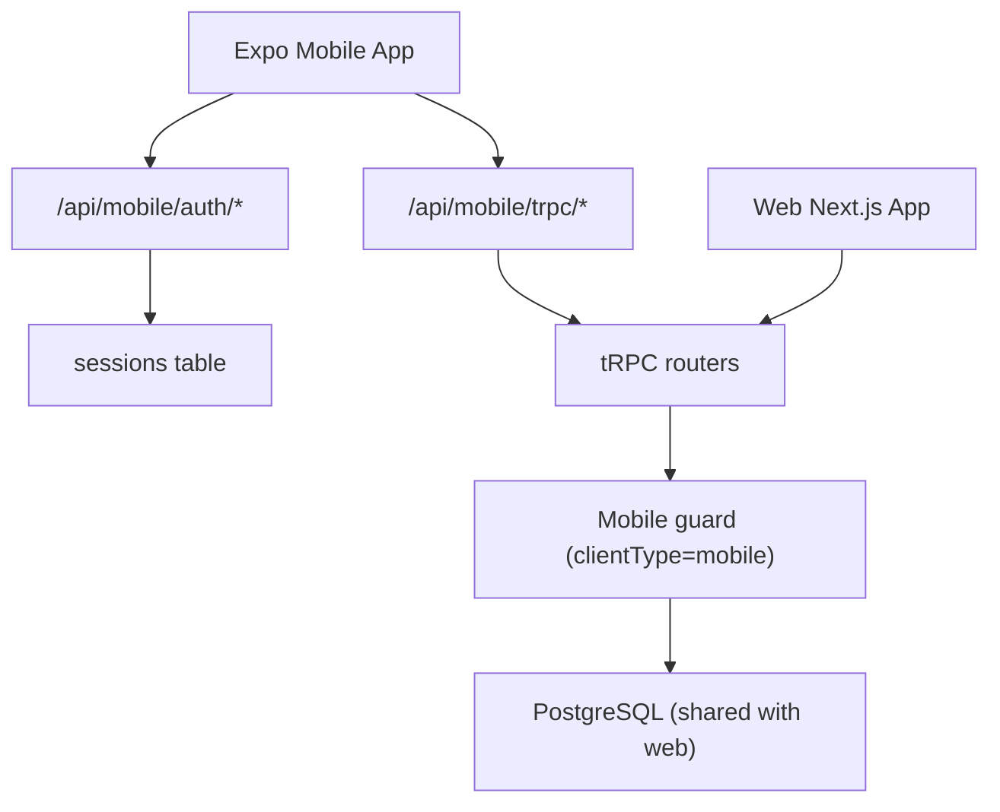

# Mobile App Architecture (MVP)

## Scope

- Mobile and web use one shared database.
- `MLP` and `INDY_LEAGUE` are registration-only on mobile.
- Management for large tournaments is web-only.
- Small tournaments, chats, and events are fully available on mobile.

## High-Level Flow

## Mobile Layers

1. Presentation
- Screens in `/Users/vasilykozlov/Documents/GitHub/piqle_web_tournament/mobile/src/screens`
- Navigation in `/Users/vasilykozlov/Documents/GitHub/piqle_web_tournament/mobile/src/navigation`
- UI components/theme in `/Users/vasilykozlov/Documents/GitHub/piqle_web_tournament/mobile/src/components` and `/Users/vasilykozlov/Documents/GitHub/piqle_web_tournament/mobile/src/theme`

2. Mobile data/auth client
- tRPC client: `/Users/vasilykozlov/Documents/GitHub/piqle_web_tournament/mobile/src/api/trpcClient.ts`
- Data adapters with fallback: `/Users/vasilykozlov/Documents/GitHub/piqle_web_tournament/mobile/src/api/mobileData.ts`
- In-memory feed cache for fast return-to-list UX: `/Users/vasilykozlov/Documents/GitHub/piqle_web_tournament/mobile/src/api/tournamentFeedCache.ts`
- Auth context and token store: `/Users/vasilykozlov/Documents/GitHub/piqle_web_tournament/mobile/src/auth`

3. API facade in Next.js
- tRPC proxy endpoint: `/Users/vasilykozlov/Documents/GitHub/piqle_web_tournament/app/api/mobile/trpc/[trpc]/route.ts`
- Mobile auth endpoints:
  - `/Users/vasilykozlov/Documents/GitHub/piqle_web_tournament/app/api/mobile/auth/signin/password/route.ts`
  - `/Users/vasilykozlov/Documents/GitHub/piqle_web_tournament/app/api/mobile/auth/session/route.ts`
  - `/Users/vasilykozlov/Documents/GitHub/piqle_web_tournament/app/api/mobile/auth/signout/route.ts`
  - `/Users/vasilykozlov/Documents/GitHub/piqle_web_tournament/app/api/mobile/auth/signup/request-code/route.ts`
  - `/Users/vasilykozlov/Documents/GitHub/piqle_web_tournament/app/api/mobile/auth/signup/complete/route.ts`

4. Domain/security layer
- tRPC client-type guard: `/Users/vasilykozlov/Documents/GitHub/piqle_web_tournament/server/trpc.ts`
- Access checks with mobile restrictions: `/Users/vasilykozlov/Documents/GitHub/piqle_web_tournament/server/utils/access.ts`
- Auth helper: `/Users/vasilykozlov/Documents/GitHub/piqle_web_tournament/lib/mobileAuth.ts`
- Rate limiter (MVP in-memory): `/Users/vasilykozlov/Documents/GitHub/piqle_web_tournament/lib/mobileRateLimit.ts`

## Screen Map (MVP)

1. `AuthScreen`
- Email/password sign-in
- Signup code request and signup completion
- API: `/api/mobile/auth/*`

2. `HomeScreen`
- Dashboard: stats, starting soon, mobile-friendly and web-only highlights
- Deep-link quick filters to `TournamentsScreen` presets (`ALL`, `MOBILE`, `WEB_ONLY`)
- API: `public.listMobileFeed` via `fetchHomeFeedSections` (same backend source as tournaments list)

3. `TournamentsScreen`
- Search + filters (policy and format), debounced query
- Pull-to-refresh + infinite scroll (auto-load on list end)
- Loading/error/retry states
- Full tournament list and quick access to details
- API first: `public.listMobileFeed` (cursor pagination), fallback: local mock pagination

4. `TournamentDetailsScreen`
- Tournament overview, format, dates, venue
- Dynamic registration status + CTA state
- API: `public.getTournamentById`, `registration.getMyStatus`

5. `RegistrationScreen`
- View seat map summary and my status
- Register via claim slot, fallback to waitlist
- API: `registration.getMyStatus`, `registration.getSeatMap`, `registration.claimSlot`, `registration.joinWaitlist`

6. `ChatsScreen`
- Event chats list
- API: `tournamentChat.listMyEventChats`

7. `MyTournamentsScreen`
- User's organizer tournaments, sign out
- API: `tournament.list` + auth session

## Permission Matrix

- Small tournaments:
  - mobile: register + chat + basic ops from allowed APIs
  - web: full management
- Large tournaments (`MLP`, `INDY_LEAGUE`):
  - mobile: registration-only and read-only flows
  - web: full management only

## Notes

- Current rate limit is per server instance (in-memory).
- For distributed/production strict limits, move limiter to Redis.
